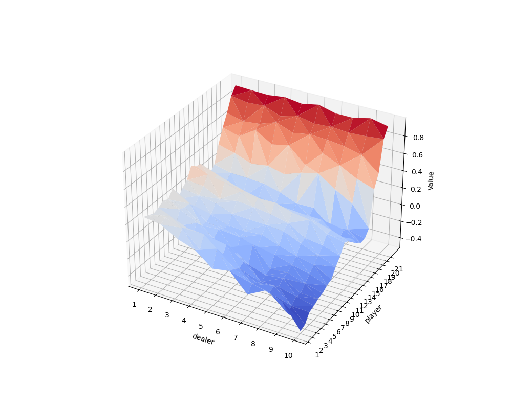
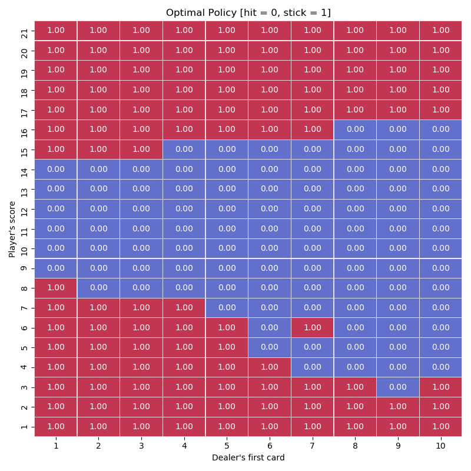
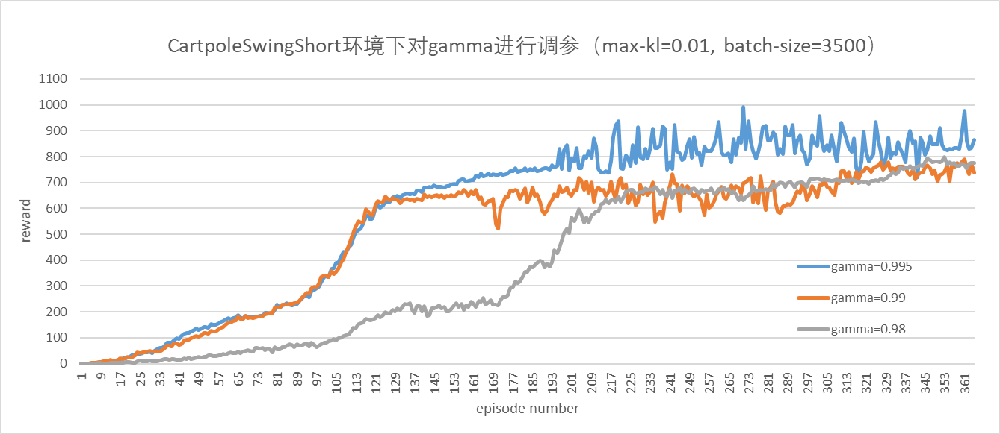
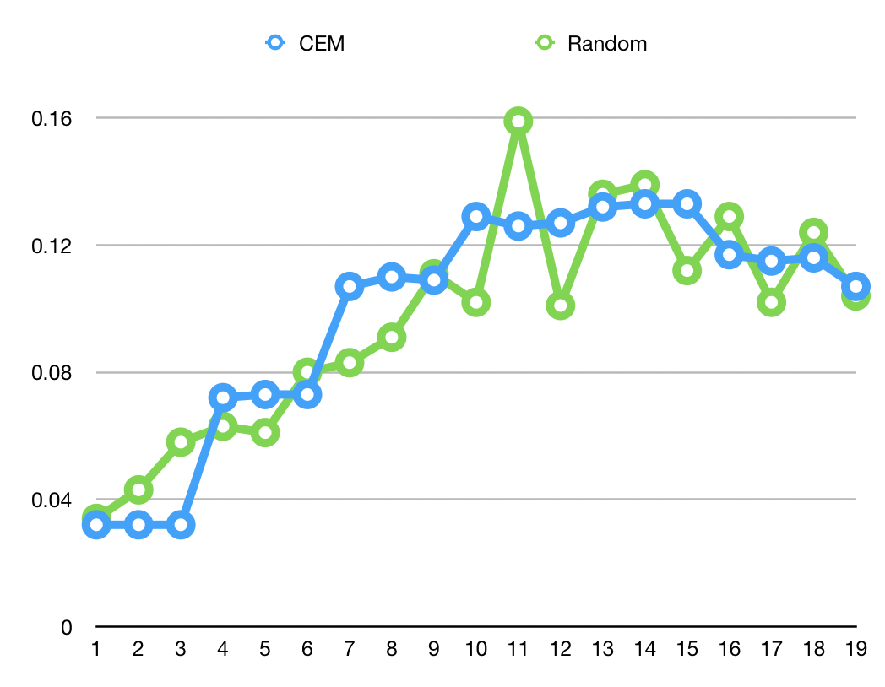

# EI339-RL-Project
Team project about reinforcement learning for SJTU EI339-Artificial Intelligence. 

In this project, we implement two tasks about reinforcement learning.  
+ Easy 21 game
+ Reinforcement learning in Quanser Robot platform

## Easy 21 game

We apply Q-learning algorithm and policy iteration method to solve Easy21 problem.  
Some learning result:  
<div  align="center">
    
</div>
  
<div  align="center">
    
</div>


## Reinforcement learning in Quanser Robot platform

We implement the TRPO and MPC methods on Qube, Ball Balancer, CartPoleSwing
platforms and solve the problem of each environment.  
For the installation of the Quanser robot simulation environment, please see
https://git.ias.informatik.tu-darmstadt.de/quanser/clients.  

Some hyperparameter experiments figures:  
<div  align="center">
    
</div>
  
<div  align="center">
    
</div>


Reference:  
+ TRPO paper: https://arxiv.org/abs/1502.05477
+ TRPO code:  https://github.com/ikostrikov/pytorch-trpo
+ MPC paper: https://ieeexplore.ieee.org/abstract/document/8463189
+ MPC code: https://github.com/michaelliyunhao/RL-project

## How to run

1. Easy 21 game  
    + Q-learning algorithm
    ```
    python .\1-Easy21\Q-learning\run_q_learning.py
    ```
    + policy iteration method
    ```
    python .\1-Easy21\Policy-iteration\run_policy_iteration.py
    ```
2. Quanser Robot platform
    + TRPO 
    ```
    python .\2-Quanser_Robot\TRPO\main.py --env-name "Qube-100-v0"
    ```
    + MPC
    ```
    python 2-Quanser_Robot\MPC\MPC-Qube\run.py
    ```
